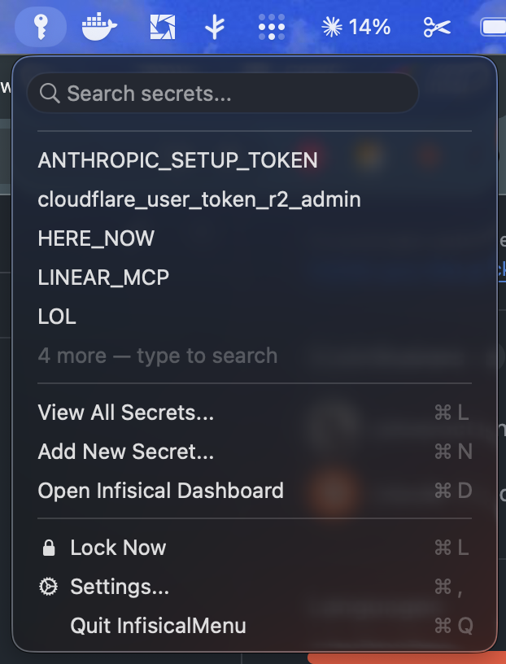
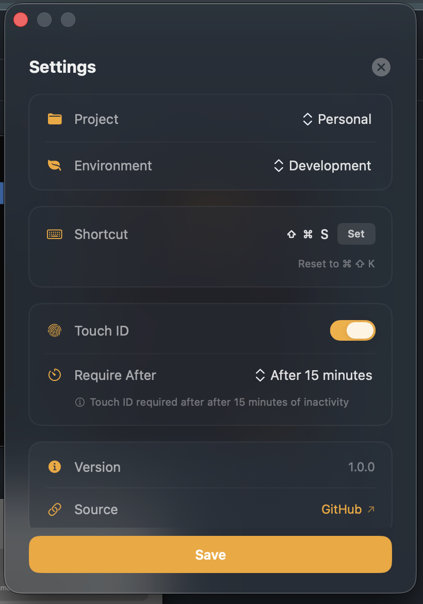

# Kubera

> *Keeper of secrets — named for the Vedic god of wealth.*

A native macOS menubar app for quickly searching and managing secrets via the [Infisical](https://infisical.com) CLI.


## Screenshots

<p align="center">
  
  &nbsp;&nbsp;
  
  &nbsp;&nbsp;
  
</p>

## Features

- **Menubar native** — lives in your system menubar as an NSMenu dropdown, no dock icon
- **Instant search** — filter secrets by name as you type (local, zero-latency)
- **One-click copy** — click any secret to copy its value, auto-clears clipboard after 30s
- **View All Secrets** — full window with search, edit, delete, version numbers, and tags
- **Add secrets** — create new secrets with tags and comments without leaving your menubar
- **Edit & delete** — update secret values/comments or delete secrets from the View All window
- **Version tracking** — see the current version number for each secret
- **Tags display** — view tags on each secret
- **Global shortcut** — `Cmd + Shift + K` toggles the menu from anywhere
- **Direct dashboard link** — opens your project directly in the Infisical web dashboard
- **CLI-powered** — uses your existing `infisical` CLI session, zero credential management
- **Dark vault UI** — custom dark theme with amber accents and smooth animations

## Install

### One-liner (recommended)

```bash
curl -fsSL https://raw.githubusercontent.com/ptmaroct/infiscal-macos/main/install.sh | bash
```

Installs the Infisical CLI (via Homebrew) if missing, downloads the latest Kubera DMG, drops it into `/Applications`, and strips the macOS quarantine flag so the unsigned app launches cleanly.

### Homebrew

```bash
brew tap ptmaroct/kubera
brew install --cask kubera
```

The cask declares `infisical` as a dependency, so the CLI is pulled in automatically.

### Manual download

1. Grab the latest `Kubera.dmg` from [Releases](https://github.com/ptmaroct/infiscal-macos/releases).
2. Mount it and drag `Kubera.app` to `/Applications`.
3. Because the build is currently unsigned, run this once to clear Gatekeeper's "App is damaged" warning:

   ```bash
   xattr -dr com.apple.quarantine /Applications/Kubera.app
   ```

4. Install the Infisical CLI separately: `brew install infisical`.

### After install

```bash
infisical login   # one-time auth
open -a Kubera    # or launch from Spotlight
```

If you want the global `Cmd + Shift + K` hotkey: **System Settings → Privacy & Security → Accessibility → enable Kubera**.

### Requirements

- macOS 13 (Ventura) or later
- [Infisical CLI](https://infisical.com/docs/cli/overview) (installed automatically by both quick-install paths)

### Build from source

```bash
swift build
bash scripts/bundle.sh
open build/Kubera.app
```

## First Launch

1. App detects your Infisical CLI session automatically
2. Select your project and environment from dropdowns
3. Click **Connect** — secrets appear in the menubar menu

## Usage

| Action | How |
|--------|-----|
| Open menu | Click the key icon in menubar, or `Cmd + Shift + K` |
| Search | Type in the search field at the top of the menu |
| Copy secret | Click any secret name — value is copied to clipboard |
| View all secrets | Menu → View All Secrets (`Cmd + L`) |
| Edit/delete secret | Open View All, use the pencil or trash icons per row |
| Add secret | Menu → Add New Secret (`Cmd + N`) |
| Open dashboard | Menu → Open Infisical Dashboard (`Cmd + D`) |
| Settings | Menu → Settings (`Cmd + ,`) |

Clipboard auto-clears after 30 seconds for security.

## Project Structure

```
Kubera/
├── KuberaApp.swift          # App entry point
├── AppDelegate.swift               # NSStatusBar, NSMenu, window management
├── Models/
│   ├── Secret.swift                # Secret model with version, tags, timestamps
│   ├── AppConfiguration.swift      # Persisted project/env/org config
│   └── APIModels.swift             # Org/project/env/tag models from API
├── Services/
│   ├── InfisicalCLIService.swift   # CLI + REST API (list, create, update, delete)
│   ├── ProjectCache.swift          # In-memory cache for projects/tags
│   └── ClipboardService.swift      # Copy with auto-clear
├── ViewModels/
│   ├── AppViewModel.swift          # Central state management
│   ├── SecretListViewModel.swift   # View All window state
│   ├── AddSecretViewModel.swift    # Add secret form state
│   └── OnboardingViewModel.swift   # Setup flow state
├── Views/
│   ├── DesignSystem.swift          # Colors, components, animations
│   ├── SecretListView.swift        # View All secrets window
│   ├── OnboardingView.swift        # First-launch setup wizard
│   ├── SettingsView.swift          # Project/env configuration
│   └── AddSecretView.swift         # Create new secret form
└── Utilities/
    ├── KeyboardShortcutNames.swift # Global hotkey (Carbon API)
    └── Constants.swift
```

## Troubleshooting

**"Kubera is damaged and can't be opened"** — the build is unsigned. Run:

```bash
xattr -dr com.apple.quarantine /Applications/Kubera.app
```

The curl and Homebrew installers do this automatically; you only need it for manual DMG installs.

**Settings stuck on "Loading…"** — your Infisical CLI session is missing or expired. Run `infisical login` and reopen Settings.

**Global hotkey (`Cmd + Shift + K`) does nothing** — grant Accessibility access in **System Settings → Privacy & Security → Accessibility**.

**Custom Infisical instance (EU / self-hosted)** — set the CLI domain first:

```bash
infisical login --domain https://eu.infisical.com   # or your self-hosted URL
```

## Why is the macOS sandbox disabled?

Kubera spawns the local `infisical` binary as a subprocess to talk to your account. The macOS app sandbox blocks arbitrary subprocess execution, so it's explicitly disabled in `Kubera.entitlements`. Nothing leaves your machine — Kubera only talks to Infisical through your already-authenticated CLI session.

## License

MIT
